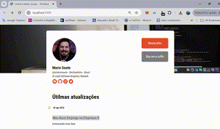

# NextJs-FullStack2

- Este projeto é fruto do curso de 'Next.js Full stack: gerenciando conteúdo em build time com File System' da plataforma ALURA

## Introdução

Esse projeto foi ministrado pelo instrutor Mario Souto e faz parte da segunda etapa do curso "Next.js Full Stack: Arquitetura de Componentes Front-end". Nessa fase, os componentes são utilizados para a conclusão do layout definido no Figma. Além disso, são abordados métodos de configuração do projeto via arquivo YAML e o uso de fontes de dados originadas em arquivos Markdown, oferecendo uma reflexão sobre as alternativas de CMS disponíveis no mercado. O objetivo do site é ser um site estático, e essa abordagem permite flexibilidade e simplicidade na geração e entrega do conteúdo.


## Apresentação do projeto

 - Nesse projeto continuamos a seguir o layout do Figma com intuito de concluir a carga das postagens

 https://www.figma.com/design/g3ZMmAOdQ1E4nsX1eVoIkT/WebSite---Timeline?node-id=0-1&node-type=canvas&t=AnbhT4GNA8fpq4N9-0


- Configurações no arquivo YML


- Configurações no arquivo MARKDOWN


 - Projeto Concluido

 


 ## Instalação do Projeto

### 1. Clonar o Repositório

Primeiramente, faça o download do código fonte deste repositório no GitHub utilizando o comando:

```bash
git clone https://github.com/msbzz/nextjs-fullstack2.git
```

### 2. Instalar as Dependências

Navegue até a pasta do projeto e instale todas as dependências necessárias utilizando o **npm** (que é instalado junto com o Node.js):

```bash
cd nextjs-fullstack
npm install
```

## Aplicativos de Interface de Usuário (IU)

Neste projeto utilizei o **vscode** mas é compatível com qualquer editor de código

- **Visual Studio Code**: Um editor leve e poderoso para desenvolvimento de aplicações web. Você pode baixá-lo [aqui](https://code.visualstudio.com/).


### Executando o Projeto

Com todas as dependências instaladas e as variáveis de ambiente configuradas, você pode iniciar o servidor de desenvolvimento do Next.js com o comando:

```bash
npm run dev
```

O projeto estará acessível em `http://localhost:3000` e, com o Ngrok ativado, também estará acessível por meio de um domínio público gerado automaticamente.


### Tópicos abordados no curso

- A importância de fazer uma reflexão antes de tentar soluções de backend em seus projetos Front-end;
- Que existem várias opções de CMS que são baseadas em arquivos estáticos e podem ser armazenadas no próprio repositório do Github;
- Que arquivos .yml são mais simples e mais diretos e por isso são excelentes para descrever configurações;
- Arquivos como markdown e JSON podem ser utilizados também para entregar conteúdos como posts para suas aplicações.
- Como lidar com caminhos de importação utilizando o path do Node Js;
- Como ler arquivos yml utilizando a biblioteca read-yaml-file;
- Como utilizar decorators para decorar informações, no sentido de adicionar configurações padrões;
- A utilizar High Order Components para decorar o comportamento de um componente;
- Como compartilhar configurações entre componentes utilizando o Context API;
- Como adicionar os ícones da página de forma dinâmica pegando informações do arquivo de configuração config.yml.
- Como organizar os arquivos de cada post em uma pasta chamada data;
- Como inserir metadados em arquivos markdown;
- Como separar metadados e o conteúdo dos posts utilizando a biblioteca gray-matter;
Uma forma melhor de lidar com datas.
- Como adicionar o conteúdo dos posts ao componente de Feed Posts;
- Como adicionar imagens nos posts.
- Como montar o layout da aplicação com todos os componentes criados nas aulas passadas;
- como estruturar o layout e estilizar conforme o Figma do projeto;
- Posicionar os elementos na tela.


